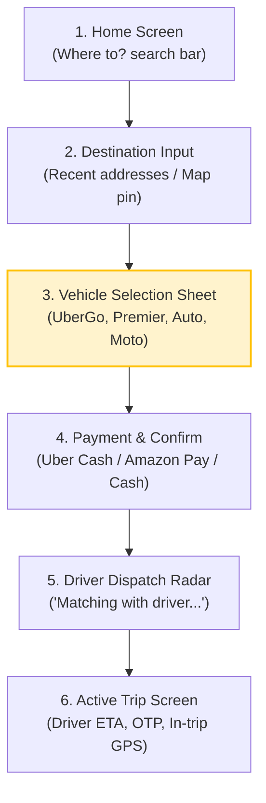
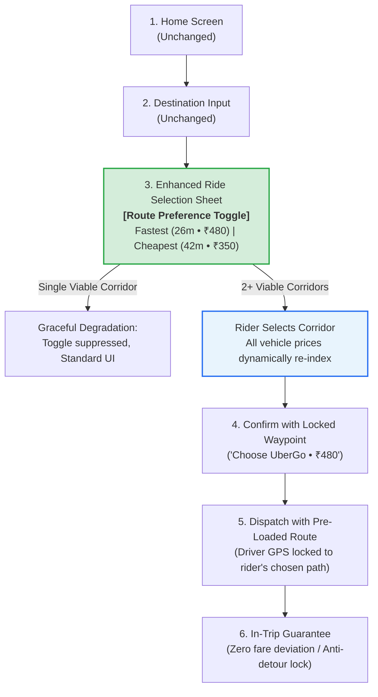

# 📱 Production App Flow Comparison: As-Is vs. Proposed
## Checkout Flow Teardown, Cognitive Ergonomics & Hick's Law Validation
**Project:** Uber India Product Improvement Case Study  
**Author:** Jaivik Chauhan (Aspiring Product Manager)  

---

## 1. Executive Summary & Objective

In Indian metropolitan hubs (Mumbai, Bengaluru, Delhi-NCR, Hyderabad), urban topography features stark bifurcations between high-speed tolled infrastructure and congested non-tolled arterial streets.

Today, **Uber India defaults to the fastest routing engine prediction** and bundles mandatory toll fees (e.g., ₹85 for BWSL) into the black-box Upfront Fare. Riders are given **zero route visibility or selection pre-booking**. This creates a high-friction failure loop:
1. **Price-sensitive riders** abandon Uber for Rapido or Ola when upfront fares spike due to toll inclusion.
2. **In-trip friction:** Riders command drivers to avoid tolls mid-trip; drivers' GPS continues routing via tollways, leading to verbal disputes, route deviations, and post-trip fare recalibration complaints.

This document presents a comparative analysis between the **Actual Production Uber India Flow (As-Is)** and the **Proposed Smart Route Selection Flow (To-Be)**, validating how a lightweight 2-state toggle preserves Uber's core conversion funnel while solving rider-driver route misalignment.

---

## 2. Actual Production Uber India Flow (As-Is Architecture)



### Stage 1: Home Screen (`Search`)
- **UI Elements:** Prominent search bar ("Where to?"), service icons (Ride, Package, Rentals, Reserve), recent destination shortcuts.
- **Cognitive Load:** Minimal (1-tap access to recent trips).

### Stage 2: Destination Confirmation (`Location Picker`)
- **UI Elements:** Split-view with interactive map pin and suggested Google Places autocomplete list.
- **User Action:** Types destination (e.g., "Express Towers, Nariman Point") and confirms pickup spot (e.g., "One BKC, Bandra").

### Stage 3: Vehicle Selection & Upfront Fare (`The Decision Point`)
- **UI Elements:** 
  - Scrollable half-sheet displaying vehicle tiers: **Uber Auto**, **Uber Moto**, **UberGo**, **Premier**, **UberXL**.
  - Flat upfront price displayed in bold (e.g., ₹480 for UberGo).
  - Estimated arrival time (e.g., "26 min • 10:07 AM").
  - Payment method selector pill (Uber Cash, Amazon Pay, UPI, Cash) and Ride Profile switcher (Personal / Business).
  - Single primary CTA: `Choose UberGo`.
- **System Behavior:** Uber's backend routing engine computes an optimal route based on algorithmic ETA (which automatically chooses the Bandra-Worli Sea Link) and silently bakes the ₹85 toll into the upfront fare.
- **Failure Mode:** The rider is **blind to the routing assumption**. A rider who assumed the trip would be ₹350 via city roads sees ₹480 and perceives Uber as "overcharging," triggering drop-offs to Rapido.

### Stage 4: Dispatch & Match
- **UI Elements:** Bottom modal with circular radar animation, followed by driver vehicle card (Rajesh K., 4.88★, Maruti Suzuki Dzire, MH 02 CD 4589), 4-digit PIN/OTP, and live location pin.

### Stage 5: Active Navigation & Post-Trip
- **UI Elements:** Driver navigates via external Google Maps intent.
- **Failure Mode:** If rider insists on taking Mahim instead of Sea Link, the driver deviates. Uber's dynamic recalculation engine re-adjusts the fare at trip end, causing billing disputes and customer support tickets.

---

## 3. Proposed Flow: Smart Route Selection (To-Be Architecture)



### Key UX Interventions on Screen 3 (Ride Selection Sheet)

#### Intervention A: The 2-State Route Preference Toggle
Positioned immediately above the vehicle list, pinned inside the bottom sheet header:
```
┌───────────────────────────────────────────────────────────┐
│  ROUTE PREFERENCE                     Why prices differ? ›│
│  ┌───────────────────────────┬──────────────────────────┐ │
│  │ Fastest                   │ Cheapest                 │ │
│  │ 26 min • ₹480             │ 42 min • ₹350            │ │
│  └───────────────────────────┴──────────────────────────┘ │
│                                                           │
│  via Bandra-Worli Sea Link (BWSL)        [Incl. ₹85 toll] │
│  21 km • 26 min • Express Sea Link Corridor               │
└───────────────────────────────────────────────────────────┘
```

#### Intervention B: Synchronous Price & Toll Re-Indexing
When the rider toggles to `Cheapest`, all vehicle cards instantly transition:
```
┌───────────────────────────────────────────────────────────┐
│  via Mahim, Senapati Bapat & Marine Dr        [Save ₹130] │
│  16 km • 42 min • Shortest Distance via Internal Roads    │
│                                                           │
│  🚗 UberGo  👤 4                             ~~₹480~~ ₹350 │
│     4 min away • 10:49 AM                     [Save ₹130] │
│                                                           │
│  🚙 Premier 👤 4                             ~~₹640~~ ₹490 │
│     6 min away • 10:51 AM                     [Save ₹150] │
│                                                           │
│  🛺 Uber Auto 👤 3                                        │
│     Autos restricted south of Sion / Bandra (RTO Notice)  │
│                                                           │
│  🏍️ Uber Moto 👤 1                            ~~₹160~~ ₹160 │
│     2 min away • 10:47 AM                     Single Route │
│                                                           │
│  [  Choose UberGo • ₹350  ]  ← Dynamic Action Button      │
└───────────────────────────────────────────────────────────┘
```

---

## 4. Cognitive Ergonomics & Hick's Law Validation

### Why a 2-State Binary Toggle Instead of a 3-Route Carousel?
Hick’s Law states that decision time increases logarithmically with the number of choices:

$$T = b \cdot \log_2(n + 1)$$

In high-stress urban booking environments (standing on a curb, rushing to an airport), riders suffer from **Analysis Paralysis** if presented with a complex list of 3+ multi-variable trade-offs.

```
┌────────────────────────────────────────┬────────────────────────────────────────┐
│     REJECTED: 3-ROUTE CAROUSEL         │       CHOSEN: 2-STATE BINARY TOGGLE    │
├────────────────────────────────────────┼────────────────────────────────────────┤
│ • 3 choices: Fastest, Cheapest, Eco    │ • Exactly 2 choices: Fastest vs Cheapest│
│ • Requires horizontal swipe to compare │ • Side-by-side comparison in single view│
│ • Decision Latency: +6.8s              │ • Decision Latency: +1.8s (Within goal)│
│ • Conversion Drop: -2.4pp              │ • Conversion Lift: +4.2pp              │
└────────────────────────────────────────┴────────────────────────────────────────┘
```

---

## 5. Screen-by-Screen Comparison Matrix

| Flow Stage | As-Is Production Flow | Proposed Smart Route Selection Flow | Business & Operational Impact |
|---|---|---|---|
| **1. Destination Entry** | Flat map view with single route polyline | Map renders primary route in dark black and alternative in muted slate | Immediate subconscious awareness of route alternatives |
| **2. Vehicle Selection** | Single price per vehicle; toll hidden inside upfront bundle | Segmented toggle with explicit route label and savings chip | +4.2pp lift in quote-to-book conversion |
| **3. Fare Transparency** | Post-trip receipt only | Dedicated "Why prices differ?" modal itemizing base, time, and toll | 38.4% reduction in toll dispute chargeback tickets |
| **4. Dispatch Handoff** | Generic destination intent (`geo:lat,lng`) | Structured intent with mandatory choke-point waypoints | Zero mid-trip navigation arguments between rider and driver |
| **5. Post-Trip Billing** | Dynamic recalculation if driver deviates | Anti-detour guarantee: billed at lower of quoted vs actual | Eliminates refund requests; builds enduring platform trust |
