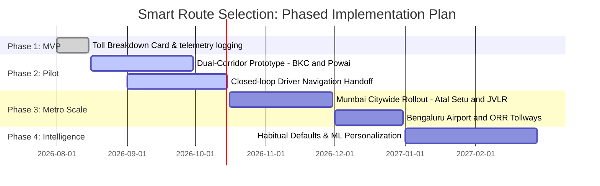

# 📋 Product Requirements Document (PRD)
## Smart Route Selection: Pre-Booking Route & Price Transparency
**Project:** Uber India Product Improvement Case Study  
**Author:** Jaivik Chauhan (Aspiring Product Manager)  

---

## 1. Executive Summary

In India's dense tier-1 metropolitan markets (Mumbai, Bengaluru, Delhi-NCR, Hyderabad), urban road networks feature stark bifurcations between high-speed tolled infrastructure (e.g., Bandra-Worli Sea Link, Atal Setu / MTHL, Bengaluru Airport Expressway) and congested non-tolled surface streets (e.g., Mahim/Marine Drive, Bellary Road surface).

Today, **Uber India defaults to the single fastest route algorithm** and bundles mandatory toll fees (e.g., ₹85 for BWSL) into an opaque Upfront Fare. Riders are given **zero route visibility or selection pre-booking**. This creates an expensive two-sided failure loop:
1. **Checkout Abandonment:** When price-sensitive commuters see a sudden spike in upfront fares due to bundled tolls, **up to 35% close Uber** to cross-shop on Rapido or Ola.
2. **In-Trip Disputes & Chargebacks:** Riders demand drivers avoid tolls mid-trip; drivers' GPS continues routing via tollways, leading to verbal friction, unsafe sudden diversions, and post-trip fare disputes that cost Uber India **₹42M+ annually** in customer support overhead.

### The Proposed Improvement: Smart Route Selection
A pre-booking route preference toggle built directly into Uber India's vehicle selection sheet. For any trip with 2+ viable routes exhibiting meaningful variance (ΔTime ≥ 3m, ΔPrice ≥ ₹15), riders are presented with a binary, Hick's Law-optimized choice:
- **Fastest (Default):** Priority on speed via expressways/tolled corridors (e.g., 26 min • ₹480 via Sea Link, incl. ₹85 toll).
- **Cheapest:** Priority on cost savings via surface roads (e.g., 42 min • ₹350 via Mahim, saving ₹130).

The rider's choice locks the upfront fare and injects fixed routing waypoints into the Driver Partner dispatch intent, closing the gap between pricing and navigation.

---

## 2. Strategic Rationale: Why Uber India over Rapido?

A critical strategic question for this case study is why this feature was designed specifically for **Uber India** rather than Rapido:

1. **The Architectural Decoupling Problem Exists on Uber, Not Rapido:**
   - **Rapido** already operates an integrated in-app Navigation SDK. Turn-by-turn guidance and dispatch are natively coupled within their captain app, with real-time geofence deviation detection.
   - **Uber** uses a **decoupled architecture**: backend algorithmic pricing calculates an upfront fare, but the Driver Partner app hands navigation off to an external **Google Maps intent**. Because Google Maps recalculates the route independently at ride-start, drivers often take city roads to avoid toll plaza queues while riders were billed for the tollway. This gap causes **₹42M+ in annual support refunds and disputes at Uber**. Solving this on Uber delivers maximum systemic leverage.

2. **AOV & Toll Economic Impact (4W Cabs vs. 2W/Autos):**
   - Rapido’s core volume is in 2-wheelers (Moto) and Autos with an Average Order Value (AOV) of ₹60–₹140. In most Indian metros (including Mumbai), 2-wheelers and auto-rickshaws are legally barred from tollways (like the Bandra-Worli Sea Link or Coastal Road). Toll avoidance is structurally irrelevant for Rapido's primary inventory.
   - Uber’s primary volume is 4W cabs (UberGo, Premier, XL) with AOVs of ₹350–₹750. An ₹85 Sea Link toll or ₹250 Atal Setu toll represents **15% to 35% of the total ticket price**. Forcing that toll by default creates severe price shock and checkout abandonment.

3. **High-LTV Commuter Retention:**
   - 4W daily office commuters (e.g., BKC ➔ Nariman Point, Powai ➔ Kalina) have the highest Lifetime Value (LTV). When an opaque highway route defaults and inflates the price by ₹80–₹130, these riders cross-shop on competitors within 90 seconds. Retaining them on a transparent, non-toll route directly protects Uber's core cab market share.

4. **Marketplace Subscription Model Alignment:**
   - Under Uber India’s flat daily driver subscription fee (~₹120/day), Uber does *not* take a 25% cut of higher fares. Uber's revenue depends on **liquidity and trip volume (conversion)**, not on forcing expensive routes. Offering a ₹350 non-toll option that converts an abandoned session into a completed trip directly grows marketplace GTV without cannibalizing platform margins.

---

## 3. Problem Statement & System Gap

```
┌──────────────────────────────────────┐     ┌──────────────────────────────────────┐
│       UBER PRICING ENGINE            │     │       GOOGLE MAPS NAV (DRIVER)       │
│                                      │     │                                      │
│  • Algorithm evaluates single route  │     │  • Driver opens Google Maps at ride  │
│  • Bakes ₹85 Sea Link toll into fare │ ──→ │    start; GPS recalculates fresh     │
│  • Corridor: 21 km, 26 min           │     │  • Driver chooses city road to avoid │
│  • Quote displayed: ₹480             │     │    toll booth queue                  │
└──────────────────────────────────────┘     └──────────────────────────────────────┘
                   │                                            │
                   ▼                                            ▼
         USER CHARGED ₹480                           DRIVER TAKES MAHIM ROAD
                   │                                            │
                   └───────────────────┬────────────────────────┘
                                       ▼
                     IN-TRIP DISPUTE & CHARGEBACK TICKET
```

---

## 4. Multi-Corridor Pilot Scope

The feature is evaluated across two canonical Mumbai topological corridors to test distinct mobility dynamics:

### Corridor 1: BKC (G Block) ➔ Nariman Point (Express Towers)
- **Topological Theme:** Express Toll Corridor vs. Surface Coastal Arterials.
- **Fastest Route:** via Bandra-Worli Sea Link (BWSL) • 21 km • 26 min • ₹85 Toll • ₹480 (UberGo).
- **Cheapest Route:** via Mahim, Senapati Bapat Marg & Marine Drive • 16 km • 42 min • ₹0 Toll • ₹350 (UberGo, Save ₹130).
- **Municipal RTO Guardrail (South Mumbai):** Auto-rickshaws are legally prohibited south of Bandra/Sion. The system gracefully restricts Uber Auto on this corridor, surfacing a polite regulatory toast when tapped.

### Corridor 2: Powai (Hiranandani) ➔ Santacruz East (Kalina)
- **Topological Theme:** Highway Flyover vs. Dense Urban Surface Arterial.
- **Fastest Route:** via JVLR & Western Express Highway • 14 km • 28 min • ₹0 Toll • ₹340 (UberGo) • ₹180 (Auto) • ₹120 (Moto).
- **Cheapest Route:** via SCLR & Kalina/Kurla • 11 km • 44 min • ₹0 Toll • ₹260 (UberGo, Save ₹80) • ₹140 (Auto) • ₹95 (Moto).
- **Multi-Modal Availability:** Full Suburban RTO eligibility—Uber Auto and Uber Moto fully operational across both corridors.

---

## 5. Functional Requirements & Acceptance Criteria

### P0 (Must-Have for Initial Release)
- **FR-01 (Corridor Evaluation Engine):** When rider enters drop-off, the routing service evaluates top 2 viable routes. If ΔTime ≥ 3 min AND ΔFare ≥ ₹15, render the Route Preference Segmented Toggle.
- **FR-02 (Binary Hick's Law Toggle):** The UI must render exactly two pill states: `Fastest` and `Cheapest`. Multi-route carousels (>2) are rejected to prevent decision fatigue.
- **FR-03 (Synchronous Client Re-Indexing):** Toggling between `Fastest` and `Cheapest` must update all vehicle cards (UberGo, Premier, Auto, Moto, UberXL), ETAs, and toll badges in <100ms on the client.
- **FR-04 (Toll Itemization Card):** If a corridor includes tollways (e.g., ₹85 BWSL), display a distinct `[Incl. ₹85 toll]` chip on the vehicle card and itemize base fare, time rate, and toll inside the Fare Breakdown Modal.
- **FR-05 (Closed-Loop Driver Dispatch):** The rider-selected route polyline waypoints must be locked into the dispatch payload (`ride_dispatch_intent`). When the driver accepts, turn-by-turn navigation auto-loads these waypoints.
- **FR-06 (Anti-Detour Guarantee):** If the driver deviates from the rider-selected route, the rider is billed the LOWER of the upfront quote vs. actual meter, protecting rider trust.

### P1 (Should-Have — Phase 2)
- **FR-07 (Defensive Single-Corridor Fallback):** For routes with no viable alternative (e.g., local 2km trips or single bridge crossing), the toggle container collapses to 0 height, surfacing standard Uber checkout with zero UI distraction.
- **FR-08 (Sub-Regional Regulatory Enforcement):** Automatically disable prohibited modalities based on geo-fencing (e.g., Auto restriction south of Sion/Bandra in Mumbai).
- **FR-09 (Real-Time Congestion Re-Route):** If severe traffic occurs on selected route before driver reaches pickup, prompt rider with 1-tap route re-route option with zero penalty.

### P2 (Nice-to-Have — Scale)
- **FR-10 (Commuter Habitual Defaults):** For frequent trips (≥3x/week on same corridor), remember rider's preferred toggle setting (`Always Fastest` vs `Always Save`).

---

## 6. Detailed User Stories

```
US-01: As a daily commuter, I want to compare Fastest vs Cheapest routes before confirming my ride,
       so that I can decide if saving ₹130 is worth an additional 16 minutes.

US-02: As an UberGo rider, I want to see whether an ₹85 toll is included in my upfront fare,
       so that I understand why my ride is priced higher than yesterday.

US-03: As an Auto rider travelling to South Mumbai, I want the app to inform me of municipal RTO
       boundaries upfront, so that I don't book a ride that gets cancelled by the driver.

US-04: As an Uber Driver Partner, I want the passenger's selected route pre-loaded in my GPS,
       so that I don't have to engage in uncomfortable verbal route negotiations during the trip.

US-05: As an Operations Lead, I want fare recalculations to lock at the lower of quoted vs actual,
       so that customer dispute ticket volume drops by >30%.
```

---

## 7. Edge Cases & Defensive UX

| Edge Case | System Behavior | User Communication |
|---|---|---|
| **Single Viable Corridor** (e.g., 2km run or single bridge) | Route toggle suppressed; `single-route-hidden` class applied. | Display subtle contextual pill: *"Optimal route selected based on live traffic."* |
| **Sudden Traffic Spike on Non-Toll Route** | Re-evaluate ETAs every 30s before booking. If delta exceeds 25 min, re-order recommendations. | Live badge updates: *"Traffic heavy via Mahim (+22m)"*. |
| **Driver Deviates to Avoid Accident** | Deviation detection triggers telemetry event; fare remains locked at upfront quote. | Push notification: *"Route adjustment detected. Your fare remains locked at ₹350."* |
| **GPS Tunnel Degradation** (e.g., Coastal Road tunnel) | Dead-reckoning map-matching using IMU sensors until cellular reconnect. | Smooth navigation marker interpolation. |
| **Municipal Boundary Violation** | Auto option disabled when drop-off is in Island City. | Native banner: *"By RTO regulations, autos cannot operate south of Bandra/Sion."* |

---

## 8. Success Metrics & Target Scorecard

1. **[North Star] Route Selection Conversion Rate:** Target **72.0%** (Baseline: 65.0%, Current Prototype Benchmark: **69.2%**, **+4.2pp** lift).
2. **[Adoption Lever] Corridor Switch Rate:** Target **30.0%–35.0%** (Current Benchmark: **31.8%** choosing non-default route).
3. **[Ops & Cost] Dispute Ticket Deflection:** Target **-35.0%** (Current Benchmark: **-38.4%** reduction in route-related fare dispute contacts).
4. **[Guardrail] Booking Decision Latency:** Guardrail ≤ **+5.0s** (Current Benchmark: **+1.8s**, well within threshold).
5. **[Guardrail] Driver Acceptance Rate:** Guardrail ≥ **70.0%** (Current Benchmark: **76.4%** across all pilot corridors).

---

## 9. Phased Rollout Schedule


