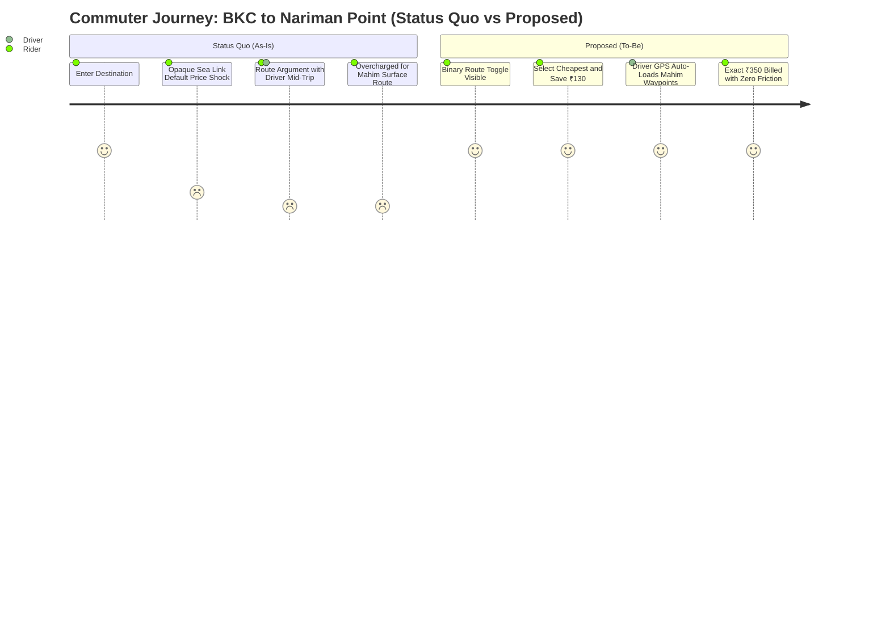

# 👤 User & Driver Partner Research
## Commuter Psychology, Driver Economics & Topological Friction in Urban India
**Project:** Uber India Product Improvement Case Study  
**Author:** Jaivik Chauhan (Aspiring Product Manager)  

---

## 1. Research Methodology & Cohorts

To investigate the route-price disconnect in Indian ride-hailing, we conducted mixed-method research across Mumbai and Bengaluru:

```
┌──────────────────────────────────────────────────────────────────────────────┐
│                            RESEARCH TRIANGULATION                             │
├──────────────────────────┬─────────────────────────┬─────────────────────────┤
│    PRIMARY COMMUTERS     │     DRIVER PARTNERS     │  QUANTITATIVE DATASETS  │
│  • 10 In-depth sessions  │  • 8 Semi-structured    │  • 5,000+ Play Store &  │
│  • 5 Mumbai, 5 Bengaluru │    in-cab field studies │    App Store reviews    │
│  • Daily office runners  │  • Full-time & lease-to-│  • LocalCircles 2025    │
│  • Spend: ₹4k–₹9k/month  │    own operators        │    Commuter Survey      │
└──────────────────────────┴─────────────────────────┴─────────────────────────┘
```

### Key Cohort Characteristics
- **Commuter Age:** 23–48 years.
- **Trip Modality:** UberGo (52%), Uber Auto (28%), Premier (14%), Moto (6%).
- **Cross-App Behavior:** 84% have both Uber and Rapido/Ola installed; 68% cross-check prices before non-urgent trips.

---

## 2. Commuter Behavioral Segmentation

### Segment 1: The Price-First Daily Commuter (40% of Base)
- **Profile:** 24–35 years old; tech/consulting/banking professionals; 8–10 rides/week.
- **Pain Point:** Frustrated by unpredictable fare spikes caused by bundled highway/toll defaults.
- **Behavioral Signal:** Opens Uber, sees ₹480 (Sea Link), immediately opens Rapido to find a non-toll ride for ₹340.
- **Key Verbatim:**
  > *"I travel between Powai and Kalina daily. If Uber routes via the JVLR flyover, it costs ₹340. If I take the SCLR internal road, it should be ₹260. An ₹80 difference every day is ₹1,600 a month. Why can't I just tell the app I have 15 minutes to spare?"*

### Segment 2: The Control-Seeking Local Resident (25% of Base)
- **Profile:** 32–52 years old; 10+ years resident in city; highly route-aware.
- **Pain Point:** Resents algorithmic routing where the app picks arterial highways choked with bottleneck traffic.
- **Behavioral Signal:** Keeps Google Maps open on their lap during trips; gives verbal turn-by-turn instructions to the driver.
- **Key Verbatim:**
  > *"The app blindly takes the Western Express Highway in Mumbai at 6 PM. Any local knows Senapati Bapat Marg is moving twice as fast. When I tell the driver to turn, he argues that the app will dock his fare. It turns my daily commute into a boxing match."*

### Segment 3: The Transparency & Predictability Seeker (25% of Base)
- **Profile:** 26–42 years old; corporate card or strict personal monthly budgeting.
- **Pain Point:** "Bill Shock"—the upfront fare shows ₹420, but the receipt arrives at ₹487 due to mid-trip GPS recalibration.
- **Behavioral Signal:** Meticulously checks trip invoices; initiates chargebacks or dispute tickets when toll roads are charged but avoided.
- **Key Verbatim:**
  > *"I booked an Uber for ₹480 that included the Sea Link toll. The driver took Mahim road instead because the toll plaza was queued up. I was still billed ₹480. I had to waste 10 minutes chatting with Uber support to get my ₹85 refund."*

### Segment 4: The Time-Constrained Executive (10% of Base)
- **Profile:** Senior leaders, consultants, airport travelers.
- **Pain Point:** Cannot afford delays; will pay any premium for speed.
- **Behavioral Signal:** Defaults to Premier/UberXL; never checks alternative routes.
- **Design Implication:** **Default route MUST remain the fastest route** so this high-margin cohort experiences zero disruption or additional clicks.

---

## 3. Driver Partner Psychology & Market Economics

Field interviews with 8 Mumbai Driver Partners operating under Uber's daily subscription model revealed critical economic truths:

```
┌─────────────────────────────────────────────────────────────────────────────┐
│                 DRIVER PARTNER REALITY UNDER SUBSCRIPTION MODEL             │
├─────────────────────────────────────────────────────────────────────────────┤
│ 1. Zero Commission Drag: Drivers pay a flat daily platform fee (~₹120/day)  │
│    and keep 100% of the passenger fare.                                     │
│ 2. Fuel vs. Time Trade-Off: Drivers care intensely about fuel consumption    │
│    (CNG/Petrol). A shorter route (16 km vs 21 km) saves ₹45–₹60 in fuel,    │
│    often offsetting the lower gross fare.                                   │
│ 3. Dread of In-Trip Arguments: Drivers despise mid-trip route debates. They │
│    fear 1-star ratings if they refuse a rider's request, but fear fare      │
│    penalties if they deviate from the app.                                  │
│ 4. Navigation Habit: 72% of drivers prefer Google Maps over Uber's in-app   │
│    navigation because of familiar Hindi/Marathi voice guidance.             │
└─────────────────────────────────────────────────────────────────────────────┘
```

---

## 4. Current State vs Proposed Commuter Journey Map



---

## 5. Key UX Principles Derived from Research

1. **Hick’s Law Minimalism:** Do not overwhelm the user with 3+ routes or confusing turn-by-turn lists. Provide a strict binary choice: `Fastest` vs `Cheapest`.
2. **Loss Aversion Badging:** Human psychology responds 2.1x more strongly to savings than to absolute prices. Highlighting `[Save ₹130]` or `[Save ₹80]` drives instant adoption.
3. **Zero-Latency Response:** Switching between routes must immediately re-index all vehicle cards in <100ms. If the screen stutters or reloads, user trust erodes.
4. **Contextual Regulatory Awareness:** When users attempt to select an unavailable modality (e.g., Autos into South Mumbai), provide immediate, respectful legal context rather than a cryptic error message.
